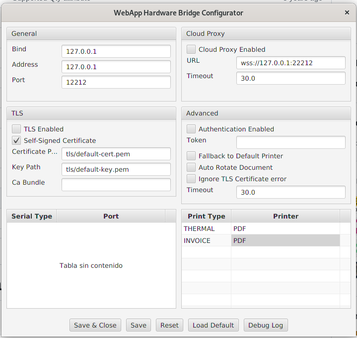
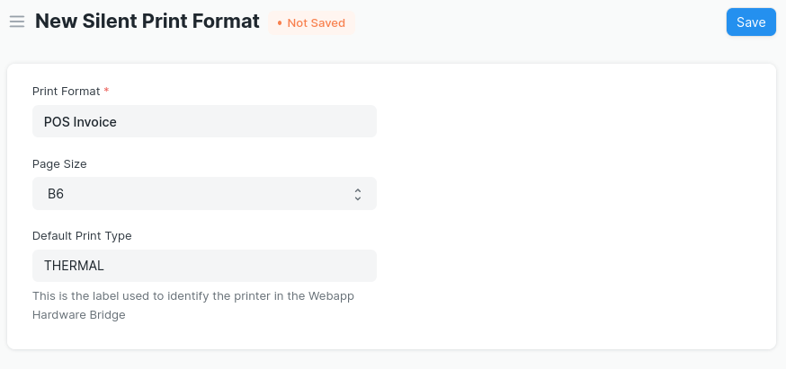

## Silent Print

This is a Frappe App for printing documents silently, that is, without having to interact with browser's print dialog and send the printing order directly to the printer.

This is achieved using the tool called [Webapp Hardware Bridge](https://github.com/imTigger/webapp-hardware-bridge) (HWB). This is basically a Java program that acts as a bridge between the webapp and hardware (printers and serial ports), accepting websocket request. 

## Why this app is needed?

To print any document, the following steps are required:

1. Click the “print” icon. This opens the print view where you can select the print format, etc
2. Click the “Print” button. This opens the browser’s print windows (after a while) where you can select the printer, etc
3. Click the “Print” button in browser’s print windows

That is, at least 3 click as required to print any document. This is a pain for many users, especially those who have many printers/print formats.

For example, in the case of a restaurant, there are two printers, one thermal printer for kitchen and another for invoices printing. Each printer needs specific print format. So, in addition to the above steps, the user has to select the print format and then the desired printer. This makes a a total of almost 7 clicks! In this scenario, the printing process is a real pain for users.

Webapps have their limit when it comes to manipulate user’s hardware (e.i. printer), because the browsers do not allow it for security reasons. When it comes to printer, the only option browsers give is to print silently, that is, the print order will be send to the printer without having to interact with browser's print dialog. In Chrome there is a `--kios-printing` flag and in Firefox there is a `always_print_silent` flag.

However, this has it limit. Once you've selected the printer that will print by default, you can't print with other printers (at least in a easy way). 

So, what is proposed with this app is that you can have more flexibility dealing with printers.

## Funtionality

So far, this app covers the following scenarios:
1. Silent Printing from standard Point of Sale (POS)
2. Silent Printing from any document via Custom Script. In this case, you could have many printers connected to your computer and the app will allow you to print to them silently (see example bellow).
3. Print from any device (even from the ones that are not connected to the printers)

## How to install it
Like any other standard frappe app:
1. bench get-app https://github.com/roquegv/Silent-Print-ERPNext
2. bench install-app silent_print

## How to use it

First, install the Webapp Hardware Bridge (WHB) in the computer which has conection to the printers.

### WHB Instalation in Windows
1. Go to the [realeses' page](https://github.com/imTigger/webapp-hardware-bridge/releases) and download the last version's .exe (in this case it is v0.14.0). 
2. Run the file.

### WHB Configuration
After the instalation finnishes, in the Windows home panel, search for the Webapp Hardware Bridge Configurator.


Go to the printer section and set a Print Type (which works like a label to identify a Printer) and then select a printer connected to your computer.

Then, click "Save & Close".

The server will be running in the background listening for websocket connections.

### Configuration in Frappe/ERPNext
Go to the awesome bar and type "Silent Print Format". Go for it and create a new one. Fill the form with this fields:
1. Print Format
2. Page size: select the paper size (as defined in [QT](https://doc.qt.io/archives/qt-4.8/qprinter.html#PaperSize-enum)). You can also select a Custom size and then will apper two fields to set the width and the height in mm.
3. Default Print Type: This allows the Point of Sale (POS) to know to which printer to print. It's the label used to identify the printer you set in the Webapp Hardware Bridge's Configurator.

Here is an example:


### Using in POS
To use this app in Point of Sales (POS), do:
1. Go to a POS Profile
2. In the Print Setting section, set the Print Format you selected in the Silent Print Format.

This implies that this Print Format will print silently when this POS Profile is used in the Point of Sale.
That is, after you completed the order, you can "Print Receipt" and it will print silently (i.e. without interacting with the browser's print dialog).

### Printing from any document via Custom Script
To be able to print form any document, follow these steps:
1. Create a New Custom Script
2. Select the Doctype (e.g. POS Invoice); "Apply To" = "Form"; "Enabled" = "on"
3. Copy and paste the following code:

```
frappe.ui.form.on('POS Invoice', {
	refresh(frm) {
		frm.add_custom_button('PRINT SILENTLY TO PRINTER 1', () => {send2bridge(frm, "POS Invoice", "PRINTER 1")})
		frm.add_custom_button('PRINT SILENTLY TO PRINTER 2', () => {send2bridge(frm, "Standard", "PRINTER 2")})
	}
})

var send2bridge = function (frm, print_format, print_type){
	// initialice the web socket for the bridge
	var printService = new frappe.silent_print.WebSocketPrinter();
	frappe.call({
		method: 'silent_print.utils.print_format.create_pdf',
		args: {
			doctype: frm.doc.doctype,
			name: frm.doc.name,
			silent_print_format: print_format,
			no_letterhead: 1,
			_lang: "es"
		},
		callback: (r) => {
			printService.submit({
				'type': print_type, //this is the label that identifies the printer in WHB's configuration
				'url': 'file.pdf',
				'file_content': r.message.pdf_base64
			});
		}
	})
}
```

This creates a two custom buttons that send the print order to the bridge, via web socket. Notice that you can send the order to any printer with any print format.

## Print Silent & Remotely
This is the same as the last scenario except that does not only print silently but also prints to any printer. This does not require that the printer is in the same LAN. The only requirement is that there sould be a system user that is logged in in the computer that has connection to the printer(s).

In order to set that user, go to the awesomebar and type "Silent Print Settings"; there select the user.

Then, create a new Custom Script, with a following code:

```
frappe.ui.form.on('POS Invoice', {
	refresh(frm) {
		frm.add_custom_button('PRINT SILENT & REMOTELY', () => {send2bridgeRemote(frm, "POS Invoice", "COMANDA")})
	}
})

var send2bridgeRemote = function (frm, print_format, print_type){
	frappe.call({
		method: 'silent_print.utils.print_format.print_silently',
		args: {
			doctype: frm.doc.doctype,
			name: frm.doc.name,
			print_format: print_format,
			print_type: print_type
		}
	})
}
```

This makes a call to the following function:

```
@frappe.whitelist()
def print_silently(doctype, name, print_format, print_type):
	data = {"doctype": doctype, "name": name, "print_format": print_format, "print_type": print_type}
	user = frappe.db.get_single_value("Silent Print Settings", "print_user")
	frappe.publish_realtime("print-silently", data, user)
```
This uses the `frappe.publish_realtime` function to send the print order to the user that has printer connection. This feature send message to every browser's tab in which the app is open. In order to avoid multiple printing (one by every tab), it's important to set a master tab that will finally send the print order. In order to do this, this app adds a icon next to the Frappe/ERPNext logo in the navbar, so when this icon in clicked, it will tell the app that this is the master tab, and the icon will turn into green.


## Comming features
- [x] Print to multiple printers at the same time
- [x] Print from any device (even from the ones that are not connected to the printers)
- [ ] Print automatically after some document event (e.g. creation)
- [ ] POS Awesome integration (?)

#### License

MIT